# BootCamp_nosql-challenge

## Part 1: Database and Jupyter Notebook Set Up

1. Import the data provided in the establishments.json file from your Terminal. Name the database uk_food and the collection establishments. Copy the text you used to import your data from your Terminal to a markdown cell in your notebook.

    

2. Within your notebook, import the libraries you need: PyMongo and Pretty Print (pprint).

    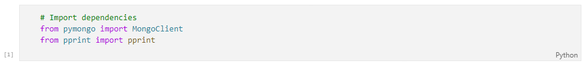

3. Create an instance of the Mongo Client.

    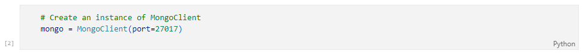

4. Confirm that you created the database and loaded the data properly:

   * List the databases you have in MongoDB. Confirm that uk_food is listed.

        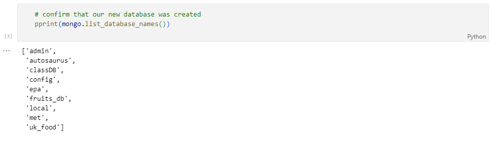

   * List the collection(s) in the database to ensure that establishments is there.

        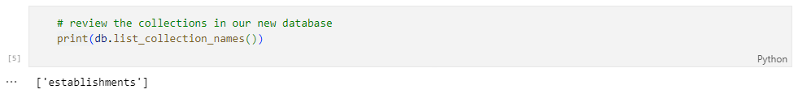

   * Find and display one document in the establishments collection using find_one and display with pprint.

        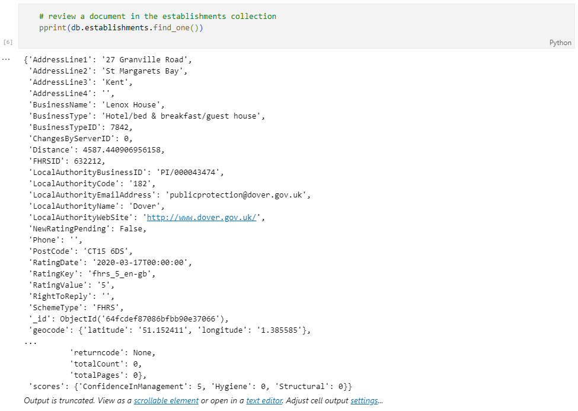

5. Assign the establishments collection to a variable to prepare the collection for use.

    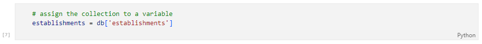

## Part 2: Update the Database

1. An exciting new halal restaurant just opened in Greenwich, but hasn't been rated yet. The magazine has asked you to include it in your analysis. Add the following information to the database:

    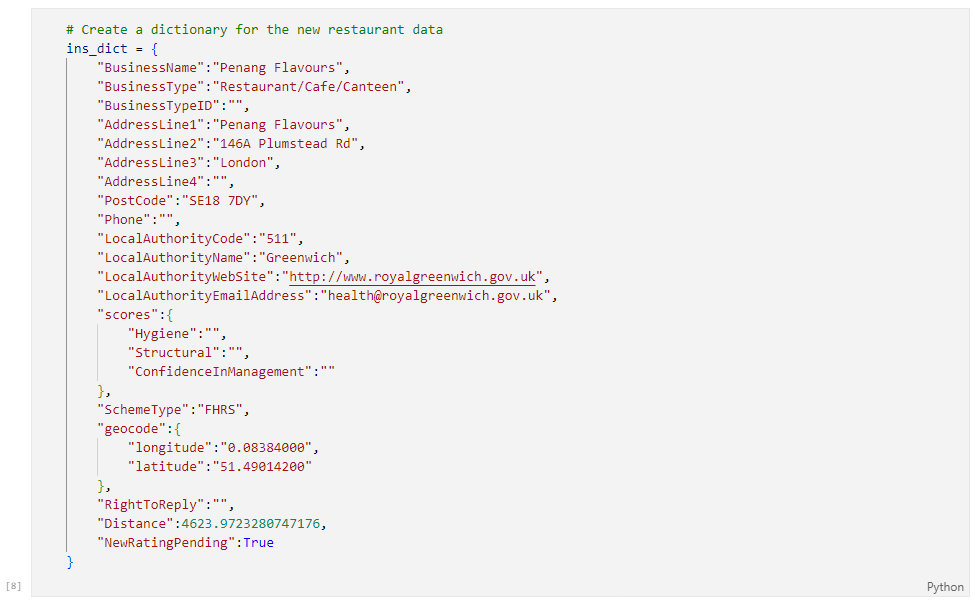

    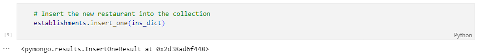

    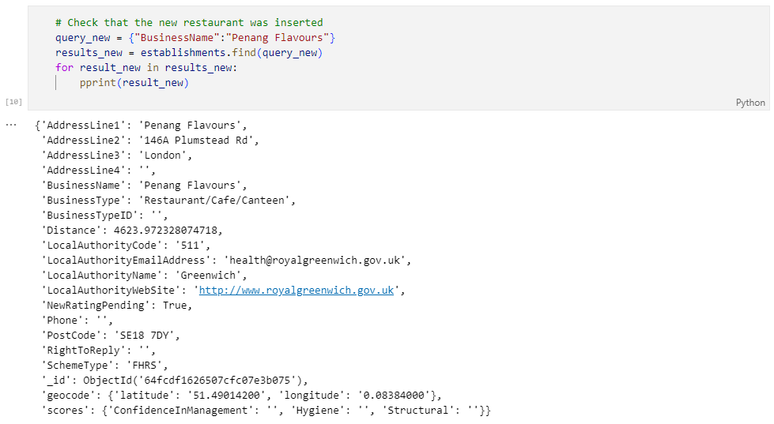

2. Find the BusinessTypeID for "Restaurant/Cafe/Canteen" and return only the BusinessTypeID and BusinessType fields.

    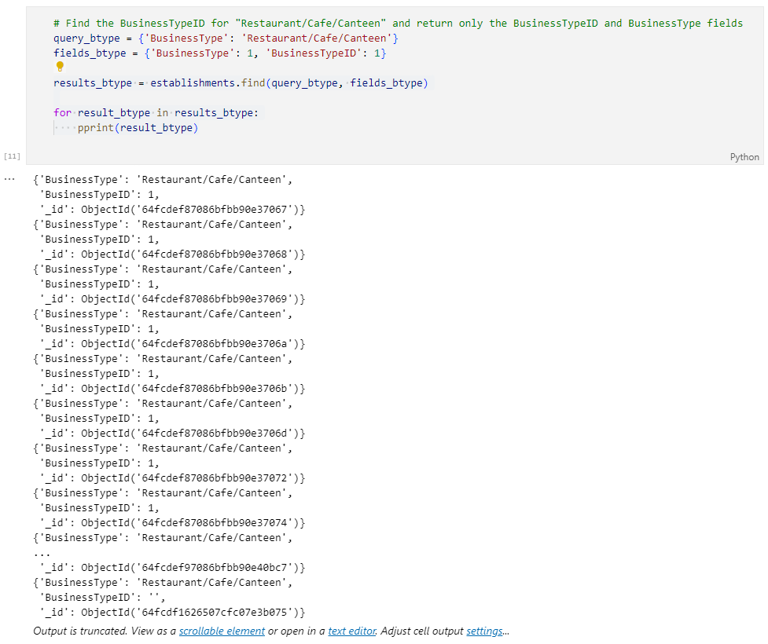

3. Update the new restaurant with the BusinessTypeID you found.

    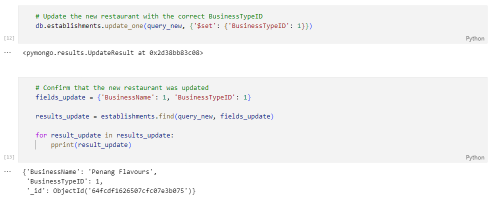

4. The magazine is not interested in any establishments in Dover, so check how many documents contain the Dover Local Authority. Then, remove any establishments within the Dover Local Authority from the database, and check the number of documents to ensure they were deleted.

    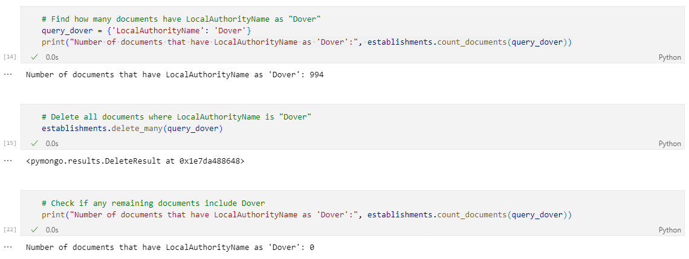

5. Some of the number values are stored as strings, when they should be stored as numbers.

   * Use update_many to convert latitude and longitude to decimal numbers.

        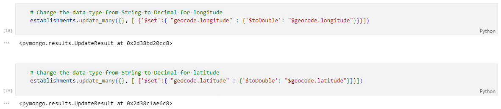

   * Use update_many to convert RatingValue to integer numbers.

        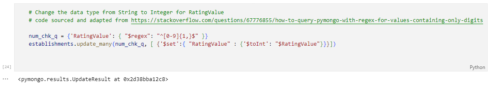

## Part 3: Exploratory Analysis

1. Which establishments have a hygiene score equal to 20?

    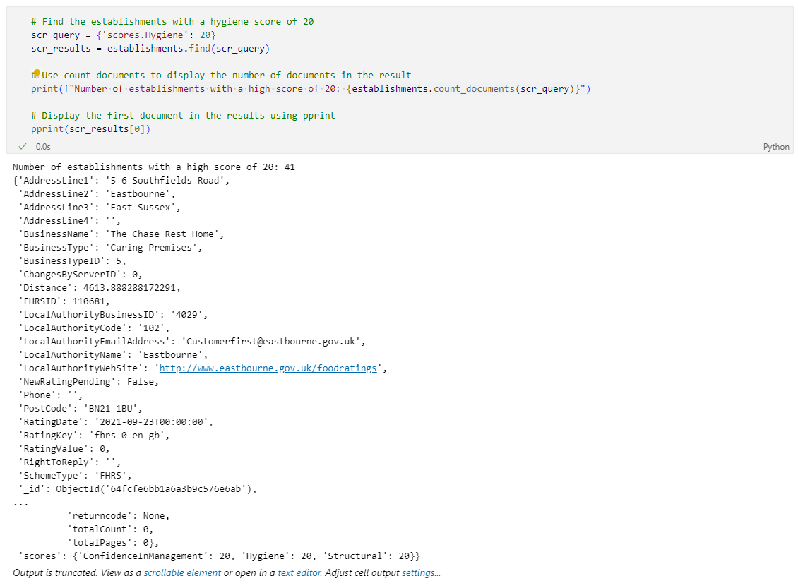

2. Which establishments in London have a RatingValue greater than or equal to 4?

    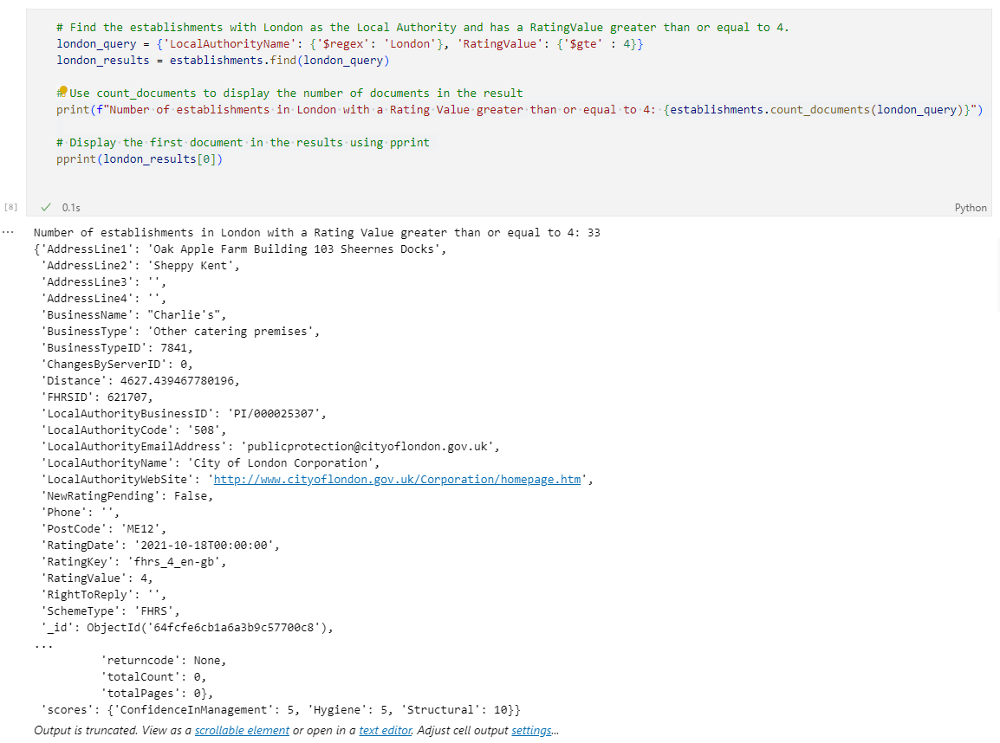

3. What are the top 5 establishments with a RatingValue of '5', sorted by lowest hygiene score, nearest to the new restaurant added, "Penang Flavours"?

    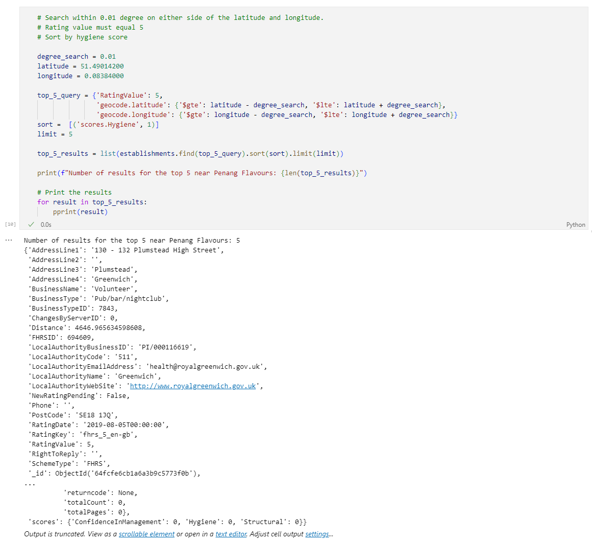

4. How many establishments in each Local Authority area have a hygiene score of 0? Sort the results from highest to lowest, and print out the top ten local authority areas.

    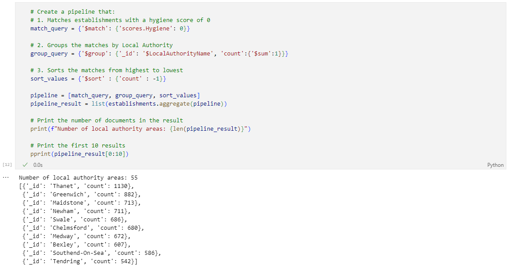